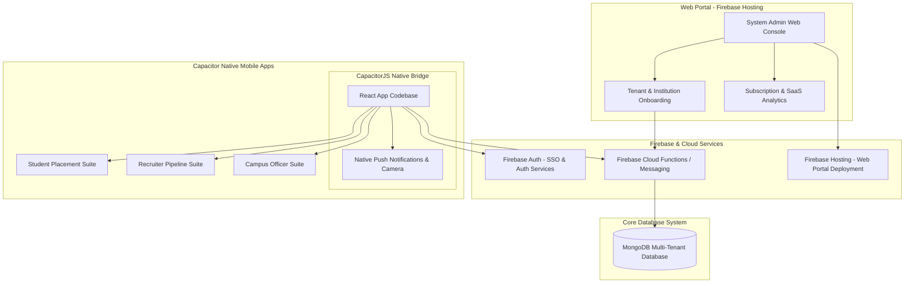
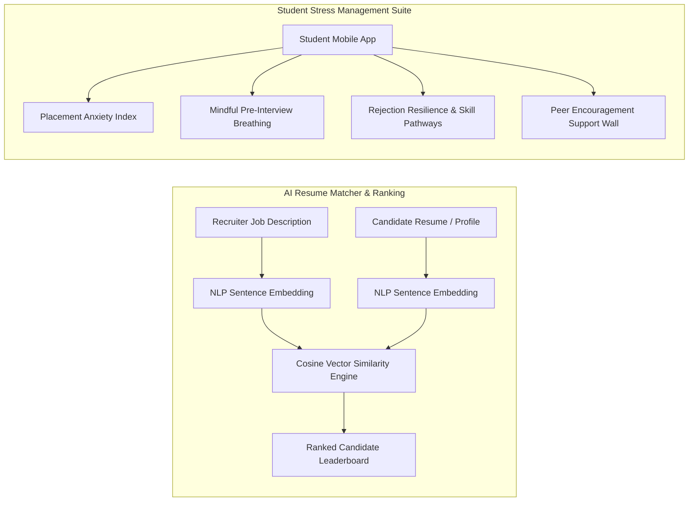

# CampusPlace - Placement Portal & Student Information System (SIS)

Welcome to **CampusPlace**, an enterprise-grade web interface designed for campus recruitment drives, student tracking, job discovery, and recruiter-candidate engagement.

---

## 📋 1. Executive Summary & Objective

**CampusPlace** aims to modernize and streamline the placement lifecycle within educational institutions. By consolidating job listings, candidate profiles, recruiter dashboards, placement updates, and direct communication into a single responsive web interface, the system eliminates administrative friction and enhances career opportunities for students.

### Key Objectives:
- **Centralize Recruitment Workflows**: Provide single-point access for students to apply to campus drives and recruiters to manage applicants.
- **Empower Students**: Enable candidates to showcase skills, build profiles, upload resumes, track application statuses, and access preparation resources.
- **Streamline Recruiter Operations**: Offer tools to post job openings, review candidate resumes, update application statuses (`shortlisted`, `rejected`, `pending`), and communicate with applicants.
- **Deliver Real-Time Updates**: Broadcast campus recruitment news, deadline alerts, and drive announcements via an interactive news ticker and update feeds.

---

## ❓ 2. Problem Statement

Traditional campus placement operations in colleges and universities suffer from multiple inefficiencies:

1. **Fragmented Communication**: Information regarding upcoming placement drives, job descriptions, and eligibility criteria is scattered across emails, notice boards, and messaging groups.
2. **Manual Application Tracking**: Placement officers and recruiters rely on manual spreadsheets to track student applications, leading to delays and tracking errors.
3. **Lack of Transparency for Students**: Candidates frequently have no visibility into their application statuses or recruiter reviews.
4. **Disjointed Resume & Profile Management**: Recruiters lack a standardized portal to view candidate skill sets, academic histories, and downloadable resume documents.

---

## 💡 3. Proposed Solution

**CampusPlace** provides a unified, web-based digital platform with role-based user interfaces:

- **Student Portal**: Interactive dashboard displaying active applications, job recommendations, application metrics, career articles, and profile customization.
- **Recruiter Portal**: Candidate management center featuring job posting forms, applicant list evaluation, application status controls, direct candidate messaging, and article publishing.
- **Campus News Hub**: Animated flash news ticker and announcement cards keeping all users informed of active recruitment drives and deadlines.
- **Modern UI/UX Design**: Built with modern web aesthetics—glassmorphism, dark/light theme switching, smooth CSS micro-animations, and responsive layouts across desktop and mobile views.

---

## 🏗️ 4. System Architecture Overview

The system architecture follows a decoupled **Client-Server Single Page Application (SPA)** model:

```mermaid
graph TD
    subgraph Client Tier [Frontend - React SPA]
        Router[React Router v6 Navigation]
        UI[UI Component Hierarchy]
        Theme[CSS Design System & Dark Mode]
        Axios[Axios HTTP Client]
    end

    subgraph Interface API Contract [RESTful API Layer - Port 5001]
        AuthAPI[/api/auth - Login/Register/Me]
        JobAPI[/api/jobs - List/Create/Apply]
        ProfileAPI[/api/profile - Update/Avatar/Resume]
        AppAPI[/api/applications - Status Updates]
        MsgAPI[/api/messages - Direct Chat]
        ArticleAPI[/api/articles - Company Posts]
    end

    subgraph Data & Storage Services [Planned Backend Backend / External Server]
        NodeServer[Node.js / Express Server]
        Database[(MongoDB / SQL Database)]
        FileStore[Static Media Storage]
    end

    Router --> UI
    UI --> Theme
    UI --> Axios
    Axios --> AuthAPI
    Axios --> JobAPI
    Axios --> ProfileAPI
    Axios --> AppAPI
    Axios --> MsgAPI
    Axios --> ArticleAPI

    AuthAPI --> NodeServer
    JobAPI --> NodeServer
    ProfileAPI --> NodeServer
    AppAPI --> NodeServer
    MsgAPI --> NodeServer
    ArticleAPI --> NodeServer

    NodeServer --> Database
    NodeServer --> FileStore
```

---

## ⚡ 5. Frank System Status Audit: Implemented vs. Non-Implemented

To maintain full transparency, below is an exact breakdown of what is currently implemented in this repository versus what is simulated or requires external backend services:

### ✅ What IS Implemented in this Codebase:

| Component / Subsystem | Implementation Details | Status |
| :--- | :--- | :--- |
| **React Single Page Application (SPA)** | Built with React 18 & React Router v6 across 13 pages/views (`Home`, `Jobs`, `JobDetails`, `Companies`, `Resources`, `Articles`, `Profile`, `Login`, `Register`, `StudentDashboard`, `RecruiterDashboard`, `Applicants`, `Messages`). | **Fully Implemented** |
| **Design System & Styling** | Custom CSS design tokens (`src/index.css`), dark/light mode toggle (`.dark-mode`), glassmorphism styling (`.glass-card`), keyframe micro-animations (`fadeIn`, `fadeInUp`, `scaleIn`), and responsive grid/flex layouts. | **Fully Implemented** |
| **Client-Side Routing Guard** | Role-based navigation guards protecting student routes (`/student/dashboard`), recruiter routes (`/recruiter/dashboard`, `/applicants/:jobId`), and profile/messaging pages (`/profile`, `/messages/:userId`). | **Fully Implemented** |
| **Interactive UI Components** | Complete user interfaces for searching/filtering jobs, posting jobs, reviewing candidate cards, writing articles, toggling application status, and editing profile details. | **Fully Implemented** |
| **Simulated Data Fallbacks** | Rich mock data embedded inside React hooks (`mockJobs`, `recentApplications`, `flashNews`, `companiesData`, `resourcesData`) allowing immediate UI rendering and demonstration without live server dependencies. | **Fully Implemented** |
| **Axios API Client Setup** | Pre-configured Axios HTTP client pointing to `http://localhost:5001/api` with `withCredentials: true` across authentication, job submission, profile updates, and messaging modules. | **Fully Implemented** |

### 🛑 What IS NOT Implemented / Simulated in this Codebase:

| Missing / Simulated Feature | Technical Reality | Next Steps Required |
| :--- | :--- | :--- |
| **Node.js / Express Backend Server Code** | The repository `o:\SIS` contains **frontend code only** (`placement-portal-frontend`). No backend `server.js`, Express routes, controllers, or backend server files are inside this codebase. | Develop or connect an external Express REST API listening on `http://localhost:5001/api`. |
| **Database Persistence** | Data state modifications (like creating jobs or applying) operate in React component memory or send API calls to port 5001. Refreshing the browser resets mock-driven states. | Provision a MongoDB or PostgreSQL database instance to persist users, applications, jobs, and chat messages. |
| **Server-Side Authentication & Sessions** | Login (`/auth/login`), registration (`/auth/register`), and session checks (`/auth/me`) are hooked up via Axios but rely on an external backend service to validate passwords and issue HTTP-only JWT cookies. | Implement JWT session middleware and bcrypt password hashing on the backend server. |
| **File Storage Handler (Multer / S3)** | Resume (`/profile/resume`) and avatar (`/profile/avatar`) file inputs submit `multipart/form-data` requests via Axios, but server-side file writing is not present in this frontend repo. | Configure Multer upload middleware on port 5001 or integrate AWS S3 / Cloudinary for document hosting. |
| **Real-Time WebSockets** | The chat interface in `Messages.js` uses short HTTP polling (`setInterval` every 5 seconds) instead of a WebSocket event connection. | Integrate Socket.io on client and server for instant bi-directional messaging. |

---

## 🛠️ 6. Technology Stack Specification

- **Frontend Framework**: React 18.2.0 (Functional Components, Hooks, Context/State)
- **Routing**: React Router DOM v6.14.0 (`BrowserRouter`, `Routes`, `Route`, `Navigate`)
- **HTTP Client**: Axios 1.5.0 (`axios.defaults.baseURL = "http://localhost:5001/api"`)
- **Iconography**: React Icons (`react-icons/fa`)
- **Styling**: Pure Vanilla CSS3 with CSS Custom Properties (Variables), Glassmorphism, animations.
- **Documentation**: Markdown + Mermaid.js System Diagrams (`SYSTEM_DESIGN.md`)

---

## 📑 7. Comprehensive Architecture Reference

For in-depth architectural details, ER diagrams, REST API specs, and component breakdowns:

👉 **[SYSTEM_DESIGN.md](file:///o:/SIS/SYSTEM_DESIGN.md)**

---

## 🚀 8. Getting Started

### Prerequisites

- Node.js (v16.0.0 or higher)
- npm (v8.0.0 or higher)

### Installation

```bash
# Clone repository
git clone <repository-url>
cd SIS

# Install dependencies
npm install
```

### Running the Application

```bash
npm start
```

Runs the application in development mode at [http://localhost:3000](http://localhost:3000).

> **Note**: To enable live data persistence and authentication, ensure an Express backend service is running on `http://localhost:5001`.

---

## 🔮 9. Proposed Next-Generation Architecture & Technical Roadmap (CampusPlace SaaS)

This section outlines the strategic technical roadmap and architectural specification for the next-generation **CampusPlace Platform**, evolving it into a multi-tenant **SaaS (Software-as-a-Service)** ecosystem (similar to exam/result management solutions like MyCamu).

### 9.1 Two-Tier Dual Application Model

The proposed platform will separate administrative management from end-user interactions across two dedicated deployment models:

1. **System Admin Web Portal (Web Application)**:
   - **Exclusively for System Admins (SaaS Platform Provider)**.
   - Hosted on **Firebase Hosting**.
   - Centralized web management console to onboard institutions/universities (Tenants), manage subscription plans, monitor platform health, configure global features, and manage SaaS-level analytics.
2. **End-User Native Mobile Application (Capacitor Cross-Platform)**:
   - **Exclusively Mobile App for Tenant Admins, Recruiters, and Students**.
   - Built by decoupling and wrapping the React web codebase using **Capacitor (CapacitorJS)** to compile native Android & iOS mobile packages (`.apk` / `.aab` / `.ipa`).
   - Lightweight mobile experience enabling native device capabilities (Push Notifications, Camera for Document Uploads, Biometric Auth) for candidates, recruiters, and placement officers on the go.



---

### 9.2 Redefined User Roles & Access Hierarchy

| Role | Interface | Deployment Target | System Responsibilities |
| :--- | :--- | :--- | :--- |
| **System Admin (SaaS Provider)** | **Web Portal Only** | Firebase Hosting | Manages multi-tenant architecture, provisions new university tenants, configures platform services, monitors system health, and manages billing/subscriptions. |
| **Tenant Admin (College Placement Officer)** | **Mobile App & Web** | Native Mobile App / Web | Oversees institution-specific recruitment drives, verifies student eligibility rules, approves recruiter access for campus drives, and generates institution placement reports. |
| **Department Coordinator (Faculty / HOD)** | **Mobile App & Web** | Native Mobile App / Web | Validates student academic records (GPA/Backlogs), verifies department-specific application eligibility, and tracks branch placement analytics. |
| **Recruiter (Corporate Partner)** | **Mobile App Only** | Native Mobile App (Capacitor) | Creates job listings for approved campus drives, evaluates candidate profiles, updates application statuses, schedules interviews, and chats directly with candidates. |
| **Interview Evaluator / Panelist** | **Mobile App Only** | Native Mobile App (Capacitor) | Conducts technical/HR assessment rounds during live placement drives, submits real-time candidate scorecards, and provides evaluation feedback. |
| **Alumni / Mentor** | **Mobile App Only** | Native Mobile App (Capacitor) | Provides 1-on-1 mentorship to junior students, shares company interview experience articles, conducts mock interviews, and offers career guidance. |
| **Student (Candidate)** | **Mobile App Only** | Native Mobile App (Capacitor) | Builds digital resume profiles, applies to eligible campus drives, tracks application progress in real-time, receives drive alerts, and accesses prep resources. |
| **Compliance Auditor (NIRF / NAAC Inspector)** | **Web Portal Only** | Firebase Hosting | Views read-only placement verification reports, verifies offer letter documentation, and audits institutional placement compliance stats for accreditation. |


---

### 9.3 Proposed Technical Stack Specification

| Architecture Layer | Technology Selection | Technical Rationale & Configuration |
| :--- | :--- | :--- |
| **Frontend Framework** | React (Multi-Page Architecture / MPA) | Modular multi-page structure for distinct administrative and user flows. |
| **Mobile Native Bridge** | **CapacitorJS (`@capacitor/core`)** | Decouples React web code and wraps it into native iOS and Android mobile binaries. |
| **Routing & Navigation** | React Router | Declarative client-side routing and protected role guards. |
| **HTTP Client** | Axios | Async API client for external service integration and microservices. |
| **Styling & UI Engine** | **Tailwind CSS** | Utility-first CSS framework for rapid, consistent, and custom responsive UI component design (replacing Vanilla CSS). |
| **Iconography** | React Icons (`react-icons`) | Scalable vector graphics library for consistent UI icons. |
| **AI & NLP Engine** | **Python Fast-API + Sentence Transformers** | Cosine similarity scoring on TF-IDF / BERT embeddings for ATS candidate auto-ranking. |
| **Backend & Cloud Services** | **Firebase** | Firebase Authentication, Cloud Functions (Serverless logic), and Firebase Cloud Messaging (FCM Push Notifications). |
| **Core Database** | **MongoDB** | Flexible NoSQL document database ideal for multi-tenant schemas, dynamic candidate profiles, and job application records. |
| **Web Hosting** | **Firebase Hosting** | Fast, secure global CDN deployment exclusively for the System Admin Web Portal. |

---

### 9.4 Advanced Specialized Modules



#### 🤖 1. AI Resume Matcher & Custom Corporate ATS Engine
- **NLP Vector Similarity Scoring**: Utilizes Sentence Transformers (BERT/SBERT embeddings) and Cosine Similarity to compute a multi-dimensional match percentage between candidate resumes and recruiter job specifications.
- **Company-Tailored Ranking Rules**: Allows corporate recruiters to set weighted parameters (e.g., 40% Core Skills, 30% Project Experience, 20% Academic GPA, 10% Certifications).
- **Automated Candidate Shortlisting**: Generates an auto-ranked leaderboard on the Recruiter Dashboard, enabling one-click bulk shortlisting of top-scoring candidates.

#### 🧘 2. Student Placement Stress & Anxiety Management Module *(Exclusively for Students)*
Designed specifically to combat overtension, interview anxiety, and placement burnout during intense campus drives:
- **Placement Anxiety Self-Assessment Index**: Interactive, confidential daily mood and stress tracker offering personalized mindfulness suggestions.
- **Pre-Interview Mindful Breathing Guides**: Quick 2-minute audio/visual haptic breathing routines built directly into the student mobile app to soothe pre-interview nerves.
- **Rejection Resilience & Growth Pathway AI**: Automatically replaces discouraging "Rejected" labels with constructive AI-generated skill gap recommendations and free preparation links.
- **Peer Encouragement & Motivation Wall**: Moderated, positive community wall where students share inspiration, tips, and support to eliminate toxic competitive stress.
- **Low-Stakes AI Mock Interview Sandbox**: Gamified practice environment where candidates rehearse answers with AI voice avatars without performance penalties or real recruiter visibility.