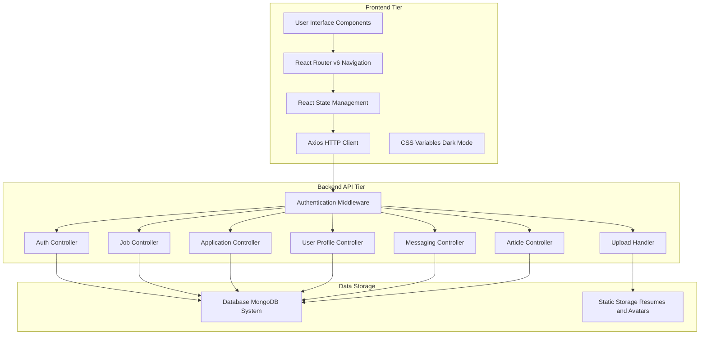
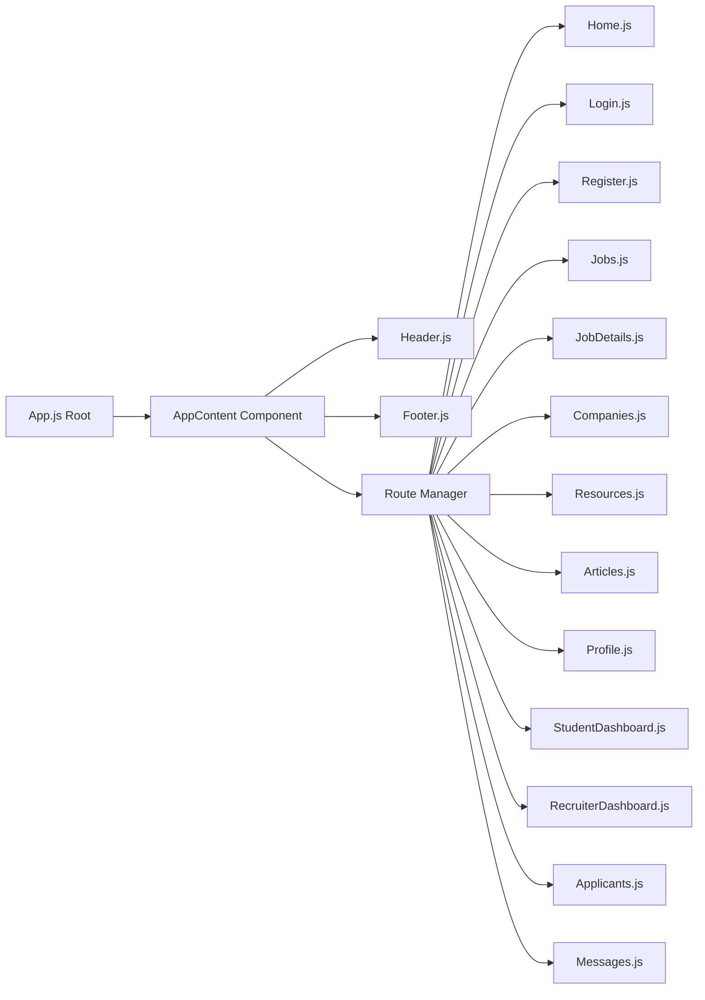
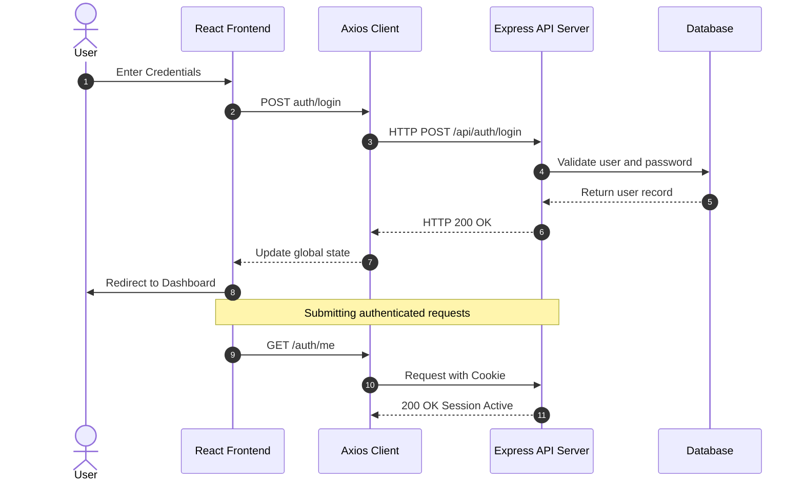
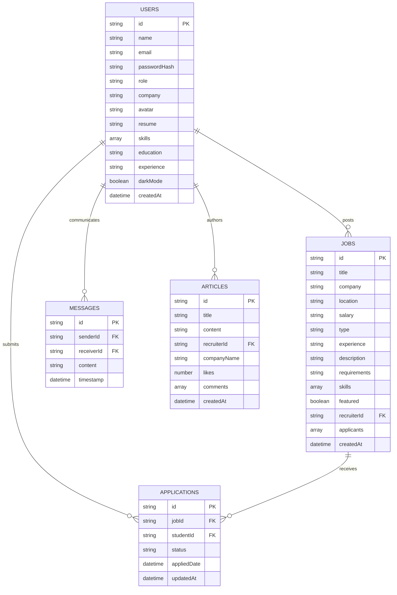

# CampusPlace - System Design & Architecture Document

## 1. Executive Summary

**CampusPlace** (Student Information System / Placement Portal) is a modern, full-stack enterprise web platform engineered to bridge students, recruiters, and educational institutions. The platform streamlines campus recruitment workflows by facilitating job discovery, candidate tracking, resume management, recruiter-candidate direct messaging, company article publishing, and real-time placement updates.

---

## 2. System Architecture Overview

The system follows a decoupled **Client-Server Architecture** utilizing a React Single Page Application (SPA) on the frontend and a Node.js/Express RESTful API service on the backend with cookie-based session/JWT authentication.



---

## 3. Technology Stack Specification

| Component Layer | Technology | Purpose & Configuration |
| :--- | :--- | :--- |
| **Frontend UI Library** | React 18.2.0 | SPA UI rendering with Functional Components & Custom Hooks |
| **Routing** | React Router DOM v6.14.0 | Declarative client-side routing & protected layout guards |
| **HTTP Client** | Axios 1.5.0 | Async API requests, base URL configured to `http://localhost:5001/api` |
| **Styling & Theme** | Vanilla CSS + Design System | Custom CSS variables, Glassmorphism, animations, Dark/Light mode |
| **UI Iconography** | React Icons (FontAwesome) | Scalable vector graphics (`react-icons/fa`) |
| **Backend Framework** | Node.js + Express.js | High-throughput async I/O REST API server running on port 5001 |
| **Authentication** | JWT / Session Cookies | Credentials-enabled CORS (`withCredentials: true`) with HTTP-only cookies |
| **File Management** | Multipart Forms (Multer) | Upload handling for avatars (`/profile/avatar`) and resumes (`/profile/resume`) |

---

## 4. Subsystem & Component Architecture

### 4.1 Frontend Component Taxonomy



#### Component Functional Matrix

1. **Authentication Engine (`Login.js`, `Register.js`)**:
   - Role selection: `student` or `recruiter`.
   - Captures name, credentials, and company name (for recruiters).
   - Establishes global auth state (`user`) on success.

2. **Student Suite (`StudentDashboard.js`, `Profile.js`, `JobDetails.js`)**:
   - **Student Dashboard**: Application metrics (Total, Shortlisted, Pending, Rejected, Profile Views, Saved Jobs), recent status tracking, recommended job matching index.
   - **Profile Management**: Inline profile editor for skills, education, and experience; file uploaders for profile avatars and resume documents (PDF, DOC, DOCX).
   - **Job Application Engine**: Browse, search, filter (location, type, experience), single-click job application submitter.

3. **Recruiter Suite (`RecruiterDashboard.js`, `Applicants.js`, `Articles.js`)**:
   - **Recruiter Dashboard**: Posting metrics, candidate metrics, integrated Job Creator form (Title, Company, Location, Salary, Type, Description, Requirements).
   - **Applicant Review Center**: Candidate cards with status toggle buttons (`Approve`, `Reject`), quick resume download links, direct messaging launcher.
   - **Company Publishing Platform**: Article creator for company updates, career tips, and placement drives with like/comment metrics.

4. **Communication & Information Suite (`Home.js`, `Messages.js`, `Resources.js`, `Companies.js`)**:
   - **Home Hub**: Hero banner, live flash news ticker, latest placement announcements grid, quick statistics counters, campus updates feed.
   - **Messaging Center**: User-to-user private chat interface with short polling (5s interval) and autoscroll message stream.
   - **Company Directory**: Searchable corporate cards with salary ranges, open position counters, ratings, and location details.
   - **Career Resources**: Categorized resource cards (Career, Interview, Skills, Productivity) with reading time estimates.

---

## 5. Security & Authentication Model

### 5.1 Authentication Flow



### 5.2 Role-Based Access Control (RBAC)

The system enforces route protection on both client-side and server-side:

| Role | Allowed Dashboard / Actions | Restricted Routes |
| :--- | :--- | :--- |
| **Guest / Anonymous** | Browse Home, Public Jobs, Companies, Resources, Public Articles, Login, Register | `/student/dashboard`, `/recruiter/dashboard`, `/profile`, `/messages/*`, `/applicants/*` |
| **Student User** | `/student/dashboard`, `/profile`, `/jobs/:id/apply`, `/messages/:userId` | `/recruiter/dashboard`, `/applicants/*`, Article Creation Form |
| **Recruiter User** | `/recruiter/dashboard`, `/applicants/:jobId`, `/messages/:userId`, Post Job, Write Article | `/student/dashboard`, Student Job Application Submission |

---

## 6. Database & Data Model Architecture

The data models map cleanly to a relational or document-oriented schema (MongoDB/JSON):



---

## 7. REST API Endpoint Specification

### 7.1 Auth & User Profile API

| Method | Endpoint | Access | Purpose |
| :--- | :--- | :--- | :--- |
| `POST` | `/api/auth/register` | Public | Register new student or recruiter account |
| `POST` | `/api/auth/login` | Public | Authenticate user & establish session |
| `GET` | `/api/auth/me` | Authenticated | Fetch current user session details |
| `POST` | `/api/auth/logout` | Authenticated | Terminate session & clear cookies |
| `PUT` | `/api/profile` | Authenticated | Update user info (name, skills, education, experience, dark mode) |
| `POST` | `/api/profile/avatar` | Authenticated | Upload profile avatar image (`multipart/form-data`) |
| `POST` | `/api/profile/resume` | Authenticated | Upload candidate resume document (`multipart/form-data`) |

### 7.2 Job & Recruitment API

| Method | Endpoint | Access | Purpose |
| :--- | :--- | :--- | :--- |
| `GET` | `/api/jobs` | Public | List all jobs with search/filters |
| `GET` | `/api/jobs/:id` | Public | Get detailed breakdown of a specific job |
| `POST` | `/api/jobs` | Recruiter | Post a new job opportunity |
| `POST` | `/api/jobs/:id/apply` | Student | Submit job application |
| `GET` | `/api/recruiter/jobs` | Recruiter | Fetch recruiter's posted jobs and applicants |
| `PUT` | `/api/applications/:jobId/:studentId` | Recruiter | Update application status (`approved`, `rejected`, `shortlisted`) |

### 7.3 Communication & Content API

| Method | Endpoint | Access | Purpose |
| :--- | :--- | :--- | :--- |
| `GET` | `/api/messages/:userId` | Authenticated | Fetch conversation history with target user |
| `POST` | `/api/messages` | Authenticated | Send direct message to a user |
| `GET` | `/api/articles` | Public | Retrieve company articles feed |
| `POST` | `/api/articles` | Recruiter | Publish a new company article |

---

## 8. Frontend Layout & Design System

The application features a modern visual design system defined in `src/index.css`:

```css
:root {
  --primary: #4f46e5;
  --primary-dark: #4338ca;
  --primary-light: #6366f1;
  --secondary: #06b6d4;
  --accent: #f59e0b;
  --success: #10b981;
  --warning: #f59e0b;
  --danger: #ef4444;
  --dark: #0f172a;
  --light: #f8fafc;
}
```

### Visual Enhancements Highlights:
- **Glassmorphism Design Cards**: Semi-transparent background panels with standard border radius and soft shadows (`glass-card`).
- **Dark Mode Support**: Dynamic body class `.dark-mode` adapting background colors, surface cards, and text contrast.
- **Keyframe CSS Micro-Animations**:
  - `fadeIn`: Smooth opacity transition.
  - `fadeInUp`: Elevation slide-in effect for list items and headers.
  - `scaleIn`: Subtle scaling transition for statistical cards.

---

## 9. Non-Functional & Quality Attributes

1. **Performance**:
   - Lightweight React single page bundle.
   - Micro-animations powered by CSS GPU acceleration (`transform`, `opacity`).
2. **Scalability**:
   - Stateless REST API backend capable of horizontal scaling behind a reverse proxy (Nginx).
   - Separated file upload handling ready for S3 / Object Storage integration.
3. **Security**:
   - Password hashing on backend.
   - CORS credential control prevents unauthorized cross-origin requests.
   - Input validation and sanitized multi-part file handling.
4. **Maintainability**:
   - Modular component structure in React.
   - Centralized CSS tokens for quick theme adjustments.

---

## 10. Future Recommendations & Technical Roadmap

- **WebSockets / Socket.io**: Upgrade messaging short-polling (5s interval) to event-driven WebSockets for instantaneous real-time chat.
- **Push Notifications**: Integrate Browser Push API / Firebase Cloud Messaging (FCM) for live job alerts.
- **AI Resume Matcher**: Implement NLP vector similarity scoring to auto-rank candidate applications against job requirements.
- **CI/CD & Dockerization**: Containerize frontend and backend with Docker & Docker Compose for automated deployment.
